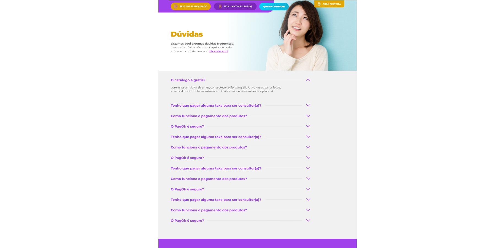

# Desafio - Vaga Desenvolvedor PHP

### Preview
Você pode visualizar o projeto publicado [clicando aqui](https://fagnerlopes.com.br/duo-desafio/)

Arquivos em anexo:
*	Arquivo .json para simular um banco de dados
*	Imagem para header do site
*	Layout do site
*	Fontes
*	Ícones

### Descrição da atividade:

Criar uma página de um site conforme o layout em anexo com front-end responsivo e back-end, onde os dados serão recuperados de um arquivo .json.

### Requisitos:

*	A página deve seguir o layout em anexo
*	O front-end deve ser responsivo
*	A página deve ter os botões do layout, mas eles não precisam ter nenhuma ação (assim como o link "clicando aqui")
*	O layout simula uma página de "Dúvidas" dentro de um site
*	Deve ser utilizado HTML, CSS, Javascript e PHP para a realização do projeto
*	A listagem de dúvidas deve ser lida do arquivo .json em anexo. Os demais textos podem ser colocado estáticos no código HTML
*	A listagem de dúvidas deve seguir o padrão de "accordion" conforme layout, quando clica expande.

### Layout base para o desenvolvimento

### Uso do projeto

1. Clonar e iniciar o projeto
~~~bash
git clone https://github.com/fagnerlopes/desafio-vaga-duo.git
cd teste-duo
php -S localhost:3000
~~~

2. Acessar a url pelo navegador

